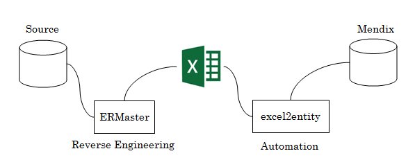

# Excel to Entity
## Overview
Automate creating entities on Mendix Platform. You can use [ER Master](http://ermaster.sourceforge.net/index.html) to reverse engineering existing data model and create excel sheets.

## Setup
To set up and use the sdk you need to have node js installed on your machine. You will need to have also installed typescript and tsd.
The following command will install typescript and tsd globally for you:

`npm install -g typescript tsd`

Open up the folder using node.js.
To install the excel2entity, type following command:

`npm install`

This is will install the sdk and all the relevant dependencies.

Then type:

`tsd install`

This will install all the necessary typings. This will only work if you have installed tsd before hand.

To connect it to your project you need to change the following constants in the `excel2entity.ts`

`const username = "{YOUR_USERNAME}";`

`const apikey = "{YOUR_API_KEY}";`

`const projectName = "{YOUR_PROJECT_NAME}";`

`const projectId = "{YOUR_PROJECT_ID}";`

and moduleName if you needed

const moduleName = "MyFirstModule";

API keys can be found in the mendix home portal.

## Using
Once the excel2entity is installed type:
`tsc`
to compile the excel2entity code.

Then after compiled type:
`node excel2entity.js`

Put template.xlsx file on same folder that was generated by ER Master.

</img>
